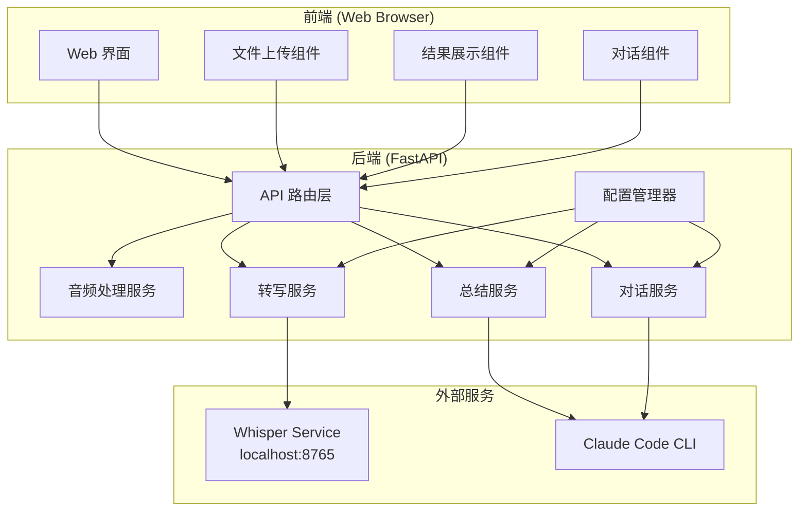
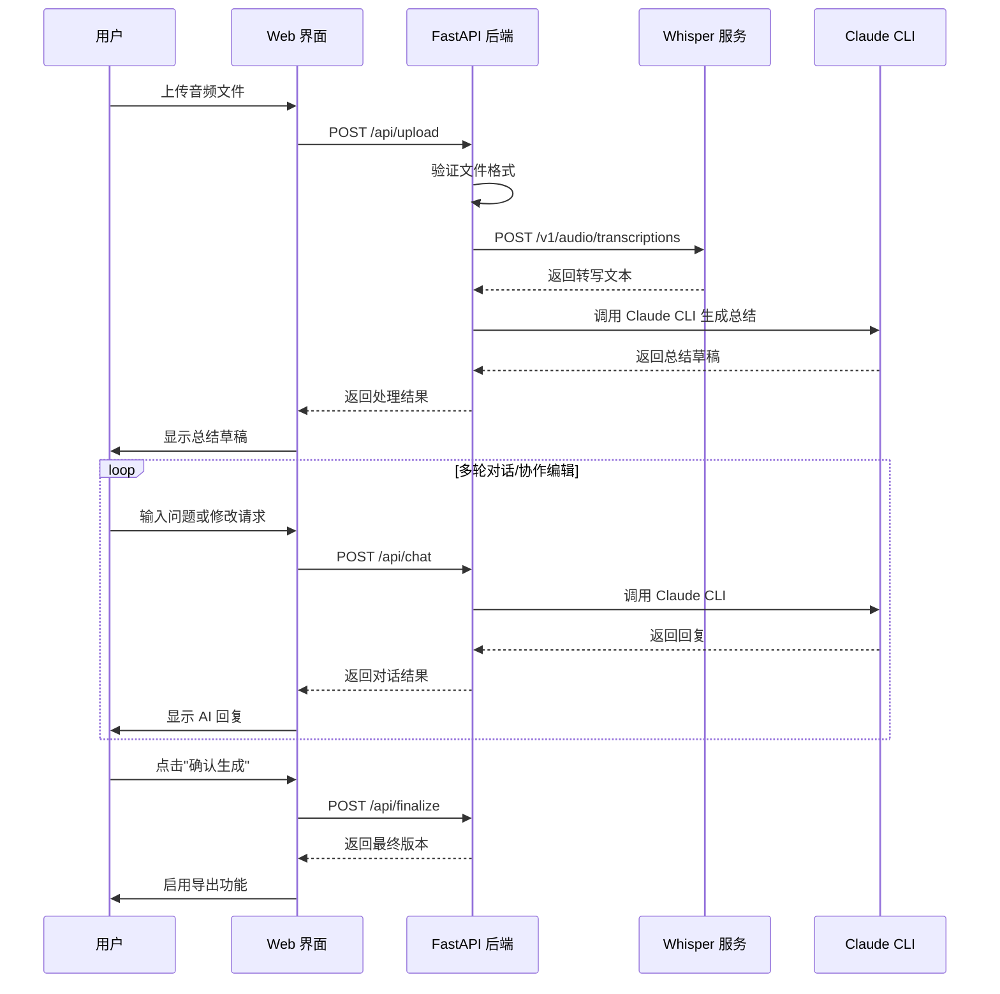

# 设计文档

## 概述

会议录音智能总结系统采用前后端分离架构，后端使用 Python FastAPI 框架，前端使用简洁的 HTML/CSS/JavaScript 实现。系统通过调用本地 Whisper 服务进行语音转文字，通过 Claude Code CLI 进行智能总结和多轮对话。

### 核心设计原则

1. **简洁性**：保持代码和界面的简洁，避免过度设计
2. **可配置性**：关键参数通过 YAML 配置文件管理
3. **可扩展性**：模块化设计，便于后续添加新功能
4. **错误友好**：提供清晰的错误提示和恢复机制

## 架构

### 系统架构图



### 处理流程图



## 组件与接口

### 后端 API 接口

#### 1. 健康检查接口

```
GET /api/health
```

**响应**:
```json
{
  "status": "healthy",
  "whisper_service": "available",
  "version": "1.0.0"
}
```

#### 2. 文件上传与处理接口

```
POST /api/upload
Content-Type: multipart/form-data
```

**请求参数**:
- `file`: 音频文件 (mp3, wav, m4a)
- `language`: 语言代码，可选，默认 "zh"

**响应**:
```json
{
  "session_id": "uuid-string",
  "transcription": "转写文本内容...",
  "summary": {
    "content": "Markdown 格式总结...",
    "status": "draft",
    "version": 1
  }
}
```

#### 3. 对话接口

```
POST /api/chat
Content-Type: application/json
```

**请求体**:
```json
{
  "session_id": "uuid-string",
  "message": "用户输入的问题或修改请求",
  "type": "question" | "edit_request"
}
```

**响应**:
```json
{
  "response": "AI 回复内容...",
  "updated_summary": {
    "content": "更新后的总结（如果是编辑请求）",
    "version": 2
  }
}
```

#### 4. 确认生成接口

```
POST /api/finalize
Content-Type: application/json
```

**请求体**:
```json
{
  "session_id": "uuid-string"
}
```

**响应**:
```json
{
  "summary": {
    "content": "最终版本的 Markdown 总结",
    "status": "final",
    "version": 3
  },
  "download_url": "/api/download/{session_id}"
}
```

#### 5. 下载接口

```
GET /api/download/{session_id}
```

**响应**: Markdown 文件下载

### 后端服务组件

#### ConfigManager（配置管理器）

```python
class ConfigManager:
    """配置管理器，负责加载和管理 YAML 配置"""
    
    def __init__(self, config_path: str = "config.yaml"):
        """初始化配置管理器"""
        pass
    
    def get_whisper_url(self) -> str:
        """获取 Whisper 服务地址"""
        pass
    
    def get_claude_command(self) -> list[str]:
        """获取 Claude CLI 命令"""
        pass
    
    def reload(self) -> None:
        """重新加载配置"""
        pass
```

#### TranscriptionService（转写服务）

```python
class TranscriptionService:
    """语音转文字服务，封装 Whisper API 调用"""
    
    def __init__(self, config: ConfigManager):
        """初始化转写服务"""
        pass
    
    async def transcribe(self, audio_file: bytes, filename: str, language: str = "zh") -> str:
        """将音频文件转写为文字"""
        pass
    
    async def check_health(self) -> bool:
        """检查 Whisper 服务健康状态"""
        pass
```

#### SummaryService（总结服务）

```python
class SummaryService:
    """智能总结服务，封装 Claude CLI 调用"""
    
    def __init__(self, config: ConfigManager):
        """初始化总结服务"""
        pass
    
    async def generate_summary(self, transcription: str) -> str:
        """根据转写文本生成会议总结"""
        pass
    
    async def update_summary(self, transcription: str, current_summary: str, 
                            edit_request: str, chat_history: list) -> str:
        """根据用户请求更新总结"""
        pass
```

#### ChatService（对话服务）

```python
class ChatService:
    """多轮对话服务"""
    
    def __init__(self, config: ConfigManager):
        """初始化对话服务"""
        pass
    
    async def chat(self, transcription: str, summary: str, 
                   message: str, history: list) -> str:
        """处理用户问答"""
        pass
```

#### SessionManager（会话管理器）

```python
class SessionManager:
    """会话管理器，管理用户会话状态"""
    
    def create_session(self) -> str:
        """创建新会话，返回 session_id"""
        pass
    
    def get_session(self, session_id: str) -> Session:
        """获取会话数据"""
        pass
    
    def update_session(self, session_id: str, data: dict) -> None:
        """更新会话数据"""
        pass
    
    def delete_session(self, session_id: str) -> None:
        """删除会话"""
        pass
```

### 前端组件

#### 页面布局

```
+------------------------------------------+
|              会议录音智能总结              |
+------------------------------------------+
|  [服务状态: ✓ Whisper 可用]              |
+------------------------------------------+
|                                          |
|     +----------------------------+       |
|     |     拖拽或点击上传音频      |       |
|     |     支持 mp3, wav, m4a     |       |
|     +----------------------------+       |
|                                          |
+------------------------------------------+
|  处理状态: [进度条]                       |
+------------------------------------------+
|  +----------------+ +------------------+ |
|  |   原始转写     | |   会议总结 [草稿] | |
|  |   (可折叠)     | |   (Markdown渲染)  | |
|  +----------------+ +------------------+ |
+------------------------------------------+
|  对话区域                                 |
|  +--------------------------------------+|
|  | AI: 总结已生成，您可以提问或请求修改  ||
|  | 用户: 请补充第二点的细节              ||
|  | AI: 好的，已更新总结...               ||
|  +--------------------------------------+|
|  +--------------------------------------+|
|  | [输入框]                    [发送]   ||
|  +--------------------------------------+|
+------------------------------------------+
|  [确认生成]  [导出 Markdown]  [复制]     |
+------------------------------------------+
```

## 数据模型

### Session（会话）

```python
@dataclass
class Session:
    """用户会话数据"""
    id: str                          # 会话唯一标识
    audio_filename: str              # 原始音频文件名
    transcription: str               # 转写文本
    summary: Summary                  # 总结对象
    chat_history: list[ChatMessage]  # 对话历史
    created_at: datetime             # 创建时间
    updated_at: datetime             # 更新时间
```

### Summary（总结）

```python
@dataclass
class Summary:
    """会议总结数据"""
    content: str                     # Markdown 格式内容
    status: str                      # 状态: draft | final
    version: int                     # 版本号
    history: list[str]               # 历史版本内容
```

### ChatMessage（对话消息）

```python
@dataclass
class ChatMessage:
    """对话消息"""
    role: str                        # 角色: user | assistant
    content: str                     # 消息内容
    message_type: str                # 类型: question | edit_request | response
    timestamp: datetime              # 时间戳
```

### Config（配置）

```yaml
# config.yaml
whisper:
  url: "http://localhost:8765"
  timeout: 300  # 秒
  language: "zh"

claude:
  command: "claude"  # 或自定义命令如 "claude --url xxx"
  timeout: 120  # 秒

server:
  host: "0.0.0.0"
  port: 8000
  upload_max_size: 100  # MB

summary:
  prompt_template: |
    请对以下会议转写内容进行智能总结：
    
    要求：
    1. 剔除废话和闲聊内容
    2. 提取会议结论性内容
    3. 保留支撑结论的关键论据和沟通要点
    4. 输出业务导向的总结报告
    5. 使用 Markdown 格式
    
    转写内容：
    {transcription}
```


## 正确性属性

*正确性属性是系统在所有有效执行中应该保持为真的特征或行为——本质上是关于系统应该做什么的形式化陈述。属性作为人类可读规范和机器可验证正确性保证之间的桥梁。*

### Property 1: 文件格式验证

*对于任意* 文件名和扩展名，文件格式验证函数应该：
- 当扩展名为 mp3、wav、m4a（不区分大小写）时返回 true
- 当扩展名为其他值时返回 false

**Validates: Requirements 1.2**

### Property 2: Markdown 格式输出与导出

*对于任意* 有效的总结内容，系统输出和导出的内容应该是有效的 Markdown 格式，且导出文件的内容应与界面显示的内容一致。

**Validates: Requirements 3.5, 4.3**

### Property 3: 对话上下文完整性

*对于任意* 用户追问请求，发送给 Claude CLI 的上下文应该包含：
- 原始转写文本
- 当前总结内容
- 完整的对话历史

**Validates: Requirements 5.2**

### Property 4: 会话历史保持

*对于任意* 会话，在用户未开始新录音处理之前，所有对话消息应该被保留在会话历史中，且消息顺序与添加顺序一致。

**Validates: Requirements 5.4**

### Property 5: 新会话清空历史

*对于任意* 会话，当用户开始处理新的录音文件时，之前的对话历史应该被完全清空，新会话的对话历史长度应为 0。

**Validates: Requirements 5.5**

### Property 6: 新总结为草稿状态

*对于任意* 新生成的总结，其初始状态应该为 "draft"，版本号应该为 1。

**Validates: Requirements 6.1**

### Property 7: 版本管理正确性

*对于任意* 总结修改操作：
- 修改后的版本号应该比修改前的版本号大 1
- 修改前的内容应该被保存到历史记录中
- 历史记录的长度应该等于当前版本号减 1

**Validates: Requirements 6.3, 6.7**

### Property 8: 确认后状态变更

*对于任意* 处于草稿状态的总结，当用户确认生成后，其状态应该变为 "final"，且状态变更后内容不应发生改变。

**Validates: Requirements 6.5**

### Property 9: 配置加载正确性

*对于任意* 有效的 YAML 配置文件，系统应该正确解析并返回配置的 Whisper 服务地址和 Claude CLI 命令。

**Validates: Requirements 7.1, 7.2**

### Property 10: 默认配置回退

*对于任意* 不存在或无效的配置文件，系统应该使用默认配置值：
- Whisper 服务地址默认为 "http://localhost:8765"
- Claude CLI 命令默认为 "claude"

**Validates: Requirements 7.4**

## 错误处理

### 错误类型与处理策略

| 错误类型 | 触发条件 | 处理策略 | 用户提示 |
|---------|---------|---------|---------|
| FileFormatError | 上传不支持的文件格式 | 拒绝上传，返回错误 | "不支持的文件格式，请上传 mp3、wav 或 m4a 文件" |
| FileSizeError | 文件超过大小限制 | 拒绝上传，返回错误 | "文件过大，请上传小于 100MB 的文件" |
| WhisperServiceError | Whisper 服务不可用 | 记录日志，返回错误 | "语音转写服务暂时不可用，请检查服务状态" |
| TranscriptionError | 转写过程失败 | 记录日志，允许重试 | "转写失败，请重试或检查音频文件" |
| ClaudeCLIError | Claude CLI 调用失败 | 记录日志，允许重试 | "AI 服务暂时不可用，请稍后重试" |
| SessionNotFoundError | 会话不存在 | 返回错误 | "会话已过期，请重新上传文件" |
| TimeoutError | 处理超时 | 允许取消，记录日志 | "处理超时，您可以取消并重新开始" |
| ConfigError | 配置文件无效 | 使用默认配置，记录警告 | 无（内部处理） |

### 错误响应格式

```json
{
  "error": {
    "code": "WHISPER_SERVICE_ERROR",
    "message": "语音转写服务暂时不可用，请检查服务状态",
    "details": "Connection refused: http://localhost:8765",
    "retry_allowed": true
  }
}
```

### 日志记录

```python
# 日志格式
{
    "timestamp": "2024-01-15T10:30:00Z",
    "level": "ERROR",
    "service": "TranscriptionService",
    "session_id": "uuid-string",
    "error_code": "WHISPER_SERVICE_ERROR",
    "message": "Failed to connect to Whisper service",
    "details": {
        "url": "http://localhost:8765",
        "timeout": 300,
        "exception": "ConnectionRefusedError"
    }
}
```

## 测试策略

### 测试方法

本项目采用双重测试方法：

1. **单元测试**：验证具体示例、边缘情况和错误条件
2. **属性测试**：验证所有输入的通用属性

两种测试方法互补，共同提供全面的测试覆盖。

### 属性测试配置

- 使用 **Hypothesis** 作为 Python 属性测试库
- 每个属性测试最少运行 **100 次迭代**
- 每个测试必须引用设计文档中的属性
- 标签格式：**Feature: meeting-summary, Property {number}: {property_text}**

### 测试用例分类

#### 单元测试

| 测试类别 | 测试内容 | 对应需求 |
|---------|---------|---------|
| 文件上传 | 验证支持的文件格式、文件大小限制 | 1.2, 1.3 |
| 转写服务 | 验证 API 调用格式、错误处理 | 2.1, 2.2, 2.4 |
| 总结服务 | 验证 Claude CLI 调用、输出格式 | 3.1, 3.5, 3.6 |
| 会话管理 | 验证会话创建、更新、删除 | 5.4, 5.5 |
| 配置管理 | 验证配置加载、默认值 | 7.1-7.5 |
| 健康检查 | 验证服务状态检测 | 8.1-8.3 |

#### 属性测试

| 属性编号 | 测试内容 | 对应需求 |
|---------|---------|---------|
| Property 1 | 文件格式验证 | 1.2 |
| Property 2 | Markdown 格式输出 | 3.5, 4.3 |
| Property 3 | 对话上下文完整性 | 5.2 |
| Property 4 | 会话历史保持 | 5.4 |
| Property 5 | 新会话清空历史 | 5.5 |
| Property 6 | 新总结为草稿状态 | 6.1 |
| Property 7 | 版本管理正确性 | 6.3, 6.7 |
| Property 8 | 确认后状态变更 | 6.5 |
| Property 9 | 配置加载正确性 | 7.1, 7.2 |
| Property 10 | 默认配置回退 | 7.4 |

### 测试目录结构

```
tests/
├── unit/
│   ├── test_audio_service.py
│   ├── test_transcription_service.py
│   ├── test_summary_service.py
│   ├── test_chat_service.py
│   ├── test_session_manager.py
│   └── test_config_manager.py
├── property/
│   ├── test_file_validation_props.py
│   ├── test_session_props.py
│   ├── test_summary_props.py
│   └── test_config_props.py
└── integration/
    ├── test_upload_flow.py
    └── test_chat_flow.py
```
